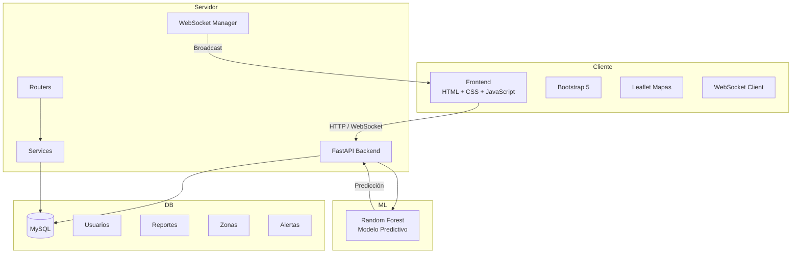

```markdown


# Santa Cruz Segura Predictiva

<div align="center">

[](https://fastapi.tiangolo.com)
[](https://python.org)
[](https://mysql.com)
[](https://leafletjs.com)
[](https://scikit-learn.org)
[](https://railway.com)

**Plataforma colaborativa de predicción del delito para Santa Cruz de la Sierra, Bolivia**

[📚 Documentación completa del proyecto](https://drive.google.com/drive/folders/1HXZqqYPVU5HvbYCr5LiGRrGLIiw-v56L?usp=sharing)

</div>

---

## 📌 Índice

- [Descripción General](#descripción-general)
- [Características Principales](#características-principales)
- [Tecnologías Utilizadas](#tecnologías-utilizadas)
- [Arquitectura del Sistema](#arquitectura-del-sistema)
- [Estructura del Proyecto](#estructura-del-proyecto)
- [Requisitos Previos](#requisitos-previos)
- [Instalación y Configuración](#instalación-y-configuración)
- [Ejecución Local](#ejecución-local)
- [Despliegue en Railway](#despliegue-en-railway)
- [Base de Datos](#base-de-datos)
- [Endpoints de la API](#endpoints-de-la-api)
- [Modelo de Machine Learning](#modelo-de-machine-learning)
- [WebSockets en Tiempo Real](#websockets-en-tiempo-real)
- [Roles y Permisos](#roles-y-permisos)
- [Manual de Usuario](#manual-de-usuario)
- [Contribuciones](#contribuciones)
- [Licencia](#licencia)
- [Contacto](#contacto)

---

## 📖 Descripción General

**Santa Cruz Segura Predictiva** es una plataforma web integral diseñada para abordar los desafíos de seguridad ciudadana en Santa Cruz de la Sierra, Bolivia. El sistema combina reportes ciudadanos, mapas interactivos, inteligencia artificial y comunicación en tiempo real para crear una herramienta colaborativa que permite anticipar incidentes delictivos.

Los vecinos pueden reportar incidentes directamente desde el mapa, los directivos de juntas vecinales pueden gestionar alertas preventivas y reactivas, las autoridades visualizan patrones de riesgo, y todo el sistema se apoya en un modelo de machine learning que predice el nivel de riesgo de cada zona para los próximos siete días.

---

## ⭐ Características Principales

| Área | Funcionalidad |
|------|---------------|
| **Autenticación** | Registro e inicio de sesión con JWT |
| **Roles de usuario** | Vecino, Directivo, Autoridad, Administrador con permisos diferenciados |
| **Mapa interactivo** | Visualización de zonas calientes, círculos de riesgo, mapa de calor |
| **Reportes** | Creación de incidentes con geolocalización, evidencias y opción anónima |
| **Alertas** | Emisión y gestión de alertas preventivas, reactivas e informativas |
| **IA Predictiva** | Predicción de nivel de riesgo para los próximos 7 días |
| **Tiempo real** | WebSockets que actualizan el mapa instantáneamente |
| **Dashboard** | Métricas, gráficas de tendencia, resumen por barrio |
| **Panel admin** | Gestión de usuarios, cambio de roles, activación/suspensión |

---

## 🛠️ Tecnologías Utilizadas

### Backend
| Tecnología | Versión | Propósito |
|------------|---------|------------|
| FastAPI | 0.111.0 | Framework web principal |
| Uvicorn | 0.29.0 | Servidor ASGI |
| SQLAlchemy | 2.0.30 | ORM para base de datos |
| PyMySQL | 1.1.0 | Conector MySQL |
| Python-JOSE | 3.3.0 | Tokens JWT |
| bcrypt | 4.2.1 | Hashing de contraseñas |
| Pydantic | 2.7.1 | Validación de datos |

### Machine Learning
| Tecnología | Versión | Propósito |
|------------|---------|------------|
| Scikit-learn | 1.6.1 | Random Forest Classifier |
| NumPy | 2.2.6 | Datos sintéticos |
| Pandas | 2.2.3 | Manipulación de datos |

### Frontend
| Tecnología | Versión | Propósito |
|------------|---------|------------|
| HTML5 + CSS3 | - | Estructura y estilos |
| Bootstrap 5 | 5.3.3 | Componentes responsivos |
| Leaflet | 1.9.4 | Mapas interactivos |
| Leaflet.heat | 0.2.0 | Mapa de calor |
| Chart.js | 4.4.2 | Gráficas |
| WebSocket API | - | Tiempo real |

### Base de Datos
| Tecnología | Versión | Propósito |
|------------|---------|------------|
| MySQL | 8.0 | Motor de base de datos |
| Triggers | - | Actualización automática de riesgos |
| Views | - | Resúmenes precalculados |

### Despliegue
| Tecnología | Versión | Propósito |
|------------|---------|------------|
| Railway | - | Plataforma cloud |
| Git | - | Control de versiones |

---

## 🏗️ Arquitectura del Sistema



**Flujo principal de datos:**

1. El usuario interactúa con el frontend (Bootstrap + Leaflet)
2. Las peticiones HTTP viajan al backend FastAPI
3. Los routers dirigen a los servicios correspondientes
4. Los servicios consultan o actualizan MySQL
5. El WebSocket Manager envía eventos en tiempo real a todos los clientes
6. El modelo Random Forest predice niveles de riesgo bajo demanda

---

## 📁 Estructura del Proyecto

```
santa-cruz-segura/
│
├── backend/
│   ├── ml/
│   │   ├── predictor.py          # Clase Predictor
│   │   └── train.py              # Entrenamiento Random Forest
│   ├── models/                   # 11 modelos SQLAlchemy
│   │   ├── usuario.py
│   │   ├── reporte.py
│   │   ├── zona_caliente.py
│   │   ├── alerta.py
│   │   └── ...
│   ├── routers/                  # Endpoints API
│   │   ├── auth.py
│   │   ├── usuarios.py
│   │   ├── reportes.py
│   │   ├── zonas.py
│   │   ├── alertas.py
│   │   ├── dashboard.py
│   │   └── ia.py
│   ├── schemas/                  # Pydantic
│   ├── services/                 # Lógica de negocio
│   ├── utils/
│   │   ├── deps.py               # Dependencias
│   │   └── security.py           # Hash y JWT
│   ├── websocket/
│   │   └── manager.py
│   ├── config.py
│   ├── database.py
│   └── main.py
│
├── frontend/
│   ├── js/
│   │   ├── api.js
│   │   ├── auth.js
│   │   ├── mapa.js
│   │   ├── dashboard.js
│   │   ├── alertas.js
│   │   └── reportar.js
│   ├── css/
│   ├── assets/
│   ├── index.html
│   ├── dashboard.html
│   ├── reportar.html
│   ├── mis-reportes.html
│   ├── gestionar-reportes.html
│   ├── alertas.html
│   └── admin.html
│
├── uploads/                      # Evidencias
├── .env.example
├── .gitignore
├── requirements.txt
├── railway.json
└── README.md
```

---

## 📋 Requisitos Previos

| Requisito | Versión |
|-----------|---------|
| Python | 3.9+ |
| MySQL | 8.0+ |
| pip | última versión |
| Git | 2.x+ (opcional) |
| Navegador | Chrome, Firefox, Edge, Safari |

---

## ⚙️ Instalación y Configuración

### 1. Clonar el repositorio

```bash
git clone https://github.com/tu-usuario/santa-cruz-segura.git
cd santa-cruz-segura
```

### 2. Crear entorno virtual

```bash
# Linux / macOS
python -m venv venv
source venv/bin/activate

# Windows
python -m venv venv
venv\Scripts\activate
```

### 3. Instalar dependencias

```bash
pip install --upgrade pip
pip install -r requirements.txt
```

### 4. Configurar variables de entorno

Crea un archivo `.env` en la raíz:

```env
DB_HOST=localhost
DB_PORT=3306
DB_NAME=santa_cruz_segura
DB_USER=root
DB_PASSWORD=tu_contraseña

SECRET_KEY=genera_una_clave_muy_segura_al_menos_64_caracteres
ALGORITHM=HS256
ACCESS_TOKEN_EXPIRE_MINUTES=480

APP_ENV=development
UPLOAD_DIR=uploads/
MAX_UPLOAD_MB=10
```

### 5. Crear la base de datos

Ejecuta el script SQL completo en MySQL Workbench.

### 6. Entrenar el modelo de Machine Learning

```bash
python backend/ml/train.py
```

Esto genera `backend/ml/model.pkl`.

---

## 🚀 Ejecución Local

```bash
uvicorn backend.main:app --reload --host 127.0.0.1 --port 8000
```

| Recurso | URL |
|---------|-----|
| Aplicación web | http://localhost:8000 |
| Documentación API (Swagger) | http://localhost:8000/docs |
| Documentación API (Redoc) | http://localhost:8000/redoc |
| WebSocket Mapa | ws://localhost:8000/ws/mapa |

---

## ☁️ Despliegue en Railway

1. Crear cuenta en https://railway.app
2. Conectar repositorio GitHub
3. Configurar variables de entorno
4. Añadir base de datos MySQL
5. Railway ejecuta automáticamente con `railway.json`

**Archivo `railway.json` incluido:**

```json
{
  "$schema": "https://railway.app/railway.schema.json",
  "build": {
    "builder": "NIXPACKS"
  },
  "deploy": {
    "startCommand": "uvicorn backend.main:app --host 0.0.0.0 --port $PORT",
    "restartPolicyType": "ON_FAILURE",
    "restartPolicyMaxRetries": 3
  }
}
```

---

## 🗄️ Base de Datos

### Modelo simplificado

- **usuario**: id_usuario, nombre, email, password_hash, id_junta, id_rol
- **junta_vecinal**: id_junta, nombre, distrito
- **zona_caliente**: id_zona, nombre, latitud, longitud, radio, nivel_riesgo
- **reporte**: id_reporte, latitud, longitud, estado, anonimo, id_zona, id_tipo
- **evidencia**: id_evidencia, tipo_archivo, ruta, id_reporte
- **alerta**: id_alerta, titulo, tipo, estado, id_zona
- **prediccion_ia**: id_prediccion, nivel_predicho, probabilidad, id_zona

### Trigger automático

Cuando se inserta un reporte, se actualiza el nivel de riesgo de la zona según la cantidad de reportes en los últimos 30 días.

---

## 📡 Endpoints de la API

| Método | Endpoint | Descripción | Rol |
|--------|----------|-------------|-----|
| POST | `/auth/login` | Iniciar sesión | Público |
| POST | `/auth/register` | Registrar usuario | Público |
| GET | `/usuarios/me` | Mi perfil | Autenticado |
| POST | `/reportes` | Crear reporte | Autenticado |
| GET | `/reportes/mis` | Mis reportes | Autenticado |
| GET | `/reportes/gestion` | Todos los reportes | Directivo/Autoridad/Admin |
| PUT | `/reportes/{id}/estado` | Cambiar estado | Directivo/Admin |
| GET | `/zonas` | Listar zonas | Autenticado |
| GET | `/alertas` | Alertas activas | Autenticado |
| POST | `/alertas` | Crear alerta | Directivo/Admin |
| POST | `/ia/predecir/{id}` | Predecir riesgo | Directivo/Autoridad/Admin |
| GET | `/dashboard/resumen` | Estadísticas | Autenticado |

---

## 🤖 Modelo de Machine Learning

**Algoritmo:** Random Forest Classifier (100 árboles)

**Característica de entrada:** total_reportes_30d

**Clases de salida:** bajo (0), medio (1), alto (2), crítico (3)

**Datos de entrenamiento (sintéticos):**

| Reportes 30d | Muestras | Etiqueta |
|--------------|----------|----------|
| 0 - 4 | 200 | bajo |
| 5 - 9 | 150 | medio |
| 10 - 19 | 100 | alto |
| 20 - 50 | 50 | crítico |

**Precisión en datos sintéticos:** >95%

---

## 🔌 WebSockets en Tiempo Real

**Conexión:**

```javascript
const ws = new WebSocket('ws://localhost:8000/ws/mapa');
```

**Mensaje de nuevo reporte:**

```json
{
  "tipo": "nuevo_reporte",
  "id_reporte": 123,
  "latitud": -17.7834,
  "longitud": -63.1821,
  "tipo_incidente": "Robo a transeúnte",
  "nivel_zona": "alto",
  "id_zona": 5
}
```

**Flujo:**
1. Usuario A crea un reporte
2. Backend guarda en MySQL
3. Backend emite broadcast a todos los clientes conectados
4. Todos ven el nuevo marcador con animación

---

## 👥 Roles y Permisos

| Rol | ID | Permisos principales |
|-----|-----|----------------------|
| **Vecino** | 1 | Reportar, ver mapa y alertas, ver sus reportes |
| **Directivo** | 2 | Todo lo de vecino + gestionar reportes, crear alertas, predecir IA |
| **Autoridad** | 3 | Todo lo de vecino + gestionar reportes (lectura), predecir IA |
| **Admin** | 4 | Todos los permisos + gestionar usuarios (roles, activar/suspender) |

---

## 👨‍💻 Manual de Usuario

### Registro e inicio de sesión

1. Accede a `http://localhost:8000`
2. Pestaña "Registrarse" → completa tus datos
3. Inicia sesión con email y contraseña

### Reportar un incidente

1. Ve a **Reportar**
2. Haz clic en el mapa donde ocurrió el incidente
3. Completa el modal (tipo, zona, descripción, fecha)
4. Opcional: adjunta evidencia o marca anónimo
5. Enviar reporte → se actualiza para todos

### Ver mis reportes

1. Ve a **Mis reportes**
2. Verás todas tus denuncias en tarjetas
3. Filtra por estado (pendiente, verificado, resuelto, descartado)

### Gestionar reportes (Directivo/Autoridad/Admin)

1. Ve a **Gestionar reportes**
2. Usa filtros para acotar la lista
3. Cambia estados: verificar, resolver, descartar

### Crear alerta (Directivo/Admin)

1. Ve a **Alertas** → "Nueva alerta"
2. Completa título, tipo, zona, junta
3. Publicar → aparece en el dashboard

### Panel de administración (Admin)

1. Ve a **Usuarios**
2. Lista completa de usuarios
3. Cambiar rol o activar/suspender cuentas

---

## 🤝 Contribuciones

1. Fork el repositorio
2. Rama de características (`git checkout -b feature/nueva-funcionalidad`)
3. Commit (`git commit -m 'Agrega nueva funcionalidad'`)
4. Push (`git push origin feature/nueva-funcionalidad`)
5. Pull Request

**Guías de estilo:**
- Python: PEP 8, 4 espacios
- JavaScript: camelCase
- CSS/HTML: kebab-case

---

## 📄 Licencia

MIT.

---

## 📞 Contacto

| Recurso | Enlace |
|---------|--------|
| Documentación completa | [Google Drive](https://drive.google.com/drive/folders/1HXZqqYPVU5HvbYCr5LiGRrGLIiw-v56L?usp=sharing) |
| Reporte de bugs | [Issues](https://github.com/tu-usuario/santa-cruz-segura/issues) |

---

<div align="center">
  <sub>Desarrollado con ❤️ para Santa Cruz de la Sierra, Bolivia</sub>
</div>
```